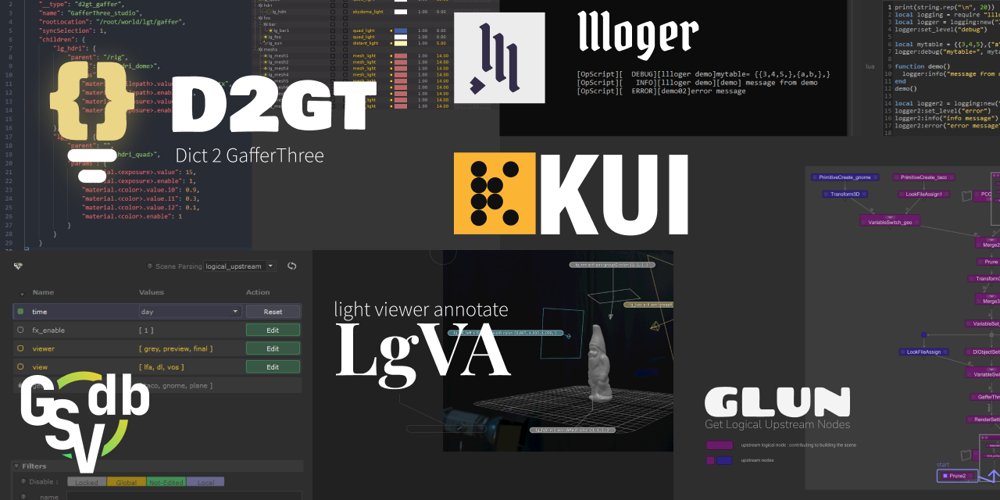

Collections of resources and tools I wrote for Foundry's Katana software.

# Utilisation

You can have a look at the  `README.md` file in each folder.

Else each script should always have a top docstring for documentation.

# Content

This repo act as a "master" repo where I just bring in all the stuff I made.
For this I'm using the git submodules feature to link other repositories.
Those submodules must always point to a certain commit so if you click on them
**make sure to switch back to the main branch.**

> **Warning** structure of the repo might sometimes completely change.

- instancing

  - [`KUI`](https://github.com/MrLixm/KUI) 
      
      Provide a flexible solution for instancing based on point-cloud locations. 

- nodegraph

  - [`CreateGSV`](./src/nodegraph/CreateGSV)

      Configure the scene's graph state variables as simple as configuring a python dictionary.

  - [`DivideResolution`](./src/nodegraph/DivideResolution)

      Divide the current render resolution by the given amount.
  
  - [`getLogicalUpstreamNodes`](./src/nodegraph/getLogicalUpstreamNodes)
     
    Parse scene to return a list of node connected to the given source node.

  - [`node2xml`](./src/nodegraph/node2xml)
     
    Convert the selected nodes to an XML representation.

  - [`BackdropAttrEdit`](./src/nodegraph/BackdropAttrEdit)

      Modify Backdrops nodes attributes.

  - [`Dict2GafferThree`](./src/nodegraph/Dict2GafferThree)

      Create and build a GafferThree node from a python dictionary.

- opscripting
  
  - [`opscripting`](https://github.com/MrLixm/opscripting)
  
    Resources to integrate the Katana OpScript workflow in a version-controled pipeline.

- supertools
  
  - [`GSVDashboard`](https://github.com/MrLixm/GSVDashboard)
  
    Preview and edit the Graph State Variables (GSV) in your nodegraph.
 
|

    

# Legal

License should be specified in each directory or in the top of each file.
If none of them is present then the license specified in this repo [LICENSE.md](./LICENSE.md) file will apply.

You can request a specific license by contacting me at [monsieurlixm@gmail.com](mailto:monsieurlixm@gmail.com) .

 
