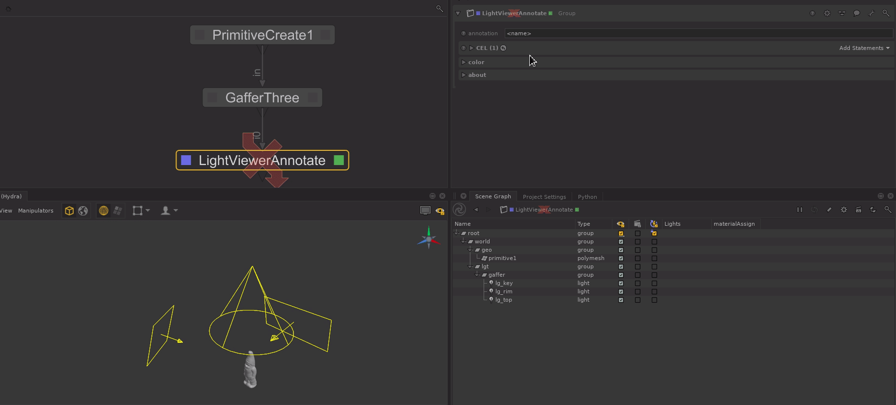
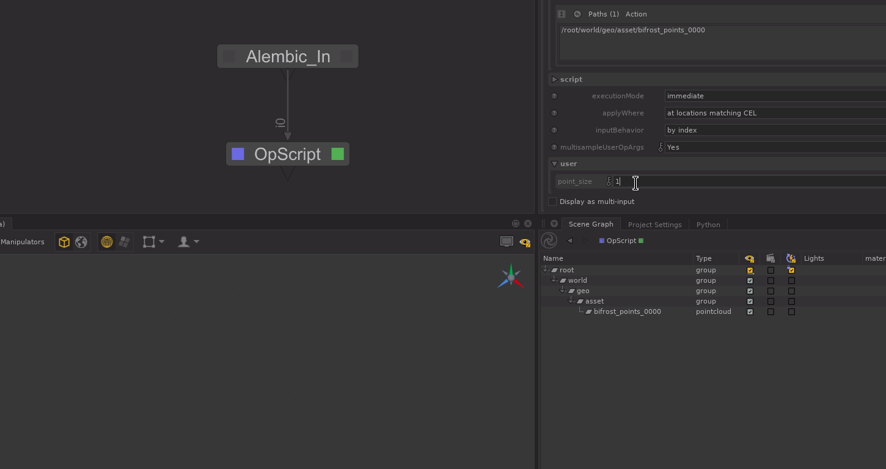

**Author:** Liam Collod.

Collections of scripting stuff I wrote for Foundry's Katana software.

| | | |
|:-------------------------:|:-------------------------:|:-------------------------:|
|  CreateGSV |   LightViewerAnnotate |  PointcloudWidth  |

## Utilisation

You can have a look at the  `README.md` file in each folder.

Else each script should always have a top docstring for documentation.

## What's Inside

- viewer
  
  - [`LightViewerAnnotate`](./src/viewer/LightViewerAnnotate) 
  
  Annotate (& color) lights in the viewer using their attributes.
  
  - [`PointcloudWidth`](./src/viewer/PointcloudWidth)
  
      Add a `geometry.point.width` attribute to control the size of the points in the viewer.
  
  - [`PointcloudXform2P`](./src/viewer/PointcloudXform2P)
    
      Allow merging xform transformations on a pointcloud location to the `geometry.point.P` attribute.
  
- nodegraph

  - [`CreateGSV`](./src/nodegraph/CreateGSV)

      Configure the scene's graph state variables as simple as configuring a python dictionary.

  - [`DivideResolution`](./src/nodegraph/DivideResolution)

      Divide the current render resolution by the given amount.

## Licensing

If no LICENSE.md file is clearly specified for a script, OR the _top docstring_ 
doesn't define a License,
 the script is by default shared under `Creative Commons Attribution
 -NonCommercial-ShareAlike 4.0 International` License.

To view a copy of this license, visit http://creativecommons.org/licenses/by-nc-sa/4.0/ .

## Contact

monsieurlixm@gmail.com

