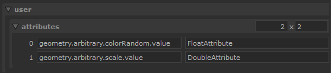

# attrTypeSwap

Quickly change the data type used for an attribute for another one.

# Use

## Installation

You can use the [createOpScript.py](createOpScript.py) file to quickly 
install the script, ready for use.

> ❕ check that the SCRIPT variable at the top of the file use the latest version
> of the [attrTypeSwap.lua](attrTypeSwap.lua) script.

To use it copy-paste the content of [createOpScript.py](createOpScript.py)
in the Python tab and execute it.

An OpScript node named `OpScript_attrTypeSwap_1` should be created at the top-left 
of the nodegraph.

## Config

First set the scene-graph location where you want to modify some of its attributes
in the `location` parameter at top.

You can then modify the `user.attributes` parameter to add attribute to modify.
Each row corresponds to an attribute to modify where :

- column [1*n] = path of the attribute relative to the location set 
- column [2*n] = new DataAttribute type to use, ex: StringAttribute

Exemple : 



List of DataAttribute can be found on
[the Katana documentation](https://learn.foundry.com/katana/5.0/dev-guide/OpsAndOpScript/Attributes/OpScript.html#IntAttribute)
but the script supports :

```
IntAttribute,
FloatAttribute
DoubleAttribute
StringAttribute
```

## Features

Support the use of multiple time samples for the source attribute.

