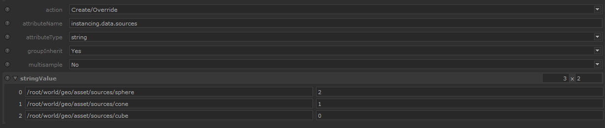
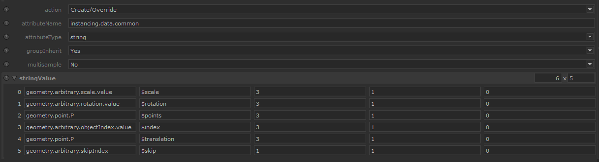
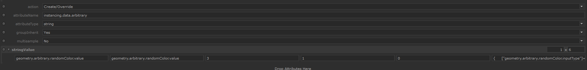

#  INDEX

Welcome on the KUI module's documentation.

[](../README.md)
[](DEVELOPER.md)

# Use

Kui is meant to be used with an OpScript node.

See [User Arguments](#user-arguments) to see how to configure the OpScript
parameters. The [Source Attributes](#source-attributes) detailed how you need
to configure the instancing source (point-cloud).
And the Installation section just under explain how to set the script.

## 1. Installation

Kui is shipped as a lua module but also as an "all in one file" script.

### As module

To register the kui module, you need to put the [kui](../kui) directory in a 
location registered by the `LUA_PATH` environment variable.

For exemple we put the `kui` directory in :

```
Z:\config\katana
└── kui
    ├── array.lua
    ├── hierarchical.lua
    └── ...
```

then our variable will be

```batch
set "LUA_PATH=%LUA_PATH%Z:\config\katana\?.lua"
```

See [Lua | 8.1 – The require Function](https://www.lua.org/pil/8.1.html) for 
more details.

As a last step you only need to put the content of
[opscript.kui.hierarchical.lua](../opscript.kui.hierarchical.lua)
in the OpScript's node `script.lua` parameter. 
(And see [User Arguments](#user-arguments) section for the other options).

## As one file script.

TODO not built yet.


## 2. Source Configuration

The script is able to support a lot of point-cloud configurations thanks to
pre-defined attributes that must be created on the source location 
(the point-cloud) :

- `instancing.data.sources` (string array) :
  - `[0*n]` = instance source location.
  - `[1*n]` = instance source index.
- `instancing.data.common` (string array) :
  These attributes are the most common ones like rotation, matrix, scale, ...
  - `[0*n]` = attribute path relative to the source.
  - `[1*n]` = token to specify what kind of data [0] corresponds to.
  - `[2*n]` = value grouping : how much value belongs to an individual point.
  - `[3*n]` = value multiplier : quick way to multiply all values.
  - `[4*n]` = value add : quick way to offset all values by adding/subtracting a value.
- `instancing.data.arbitrary` (string array) :
  Only you know why this attribute will be useful, they will just be transfered
  to the instance for whatever you need them for.
  - `[0*n]` = attribute path relative to the source.
  - `[1*n]` = target attribute path relative to the instance.
  - `[2*n]` = value grouping : how much value belongs to an individual point.
  - `[3*n]` = value multiplier : quick way to multiply values.
  - `[4*n]` = value add : quick way to offset all values by adding/subtracting a value.
  - `[5*n]` = (optional) additional attributes that must be created on instance. Must be a valid Lua table.

*See under for detailed explanations.*

### values quick modification

When using the multiplier, or additive attribute, final value is processed as such :

```
value = value * multiplier + additive
```

So basic maths, use 1 for multiplier and 0 for additive if no modification is needed.

> ❕ If you use this feature on attribute like `rotationX` token, the math will be 
applied on all values, including the axis ones, which will led to weird results.


### instancing.data.sources



#### column 0

Instance Source's scene graph location to use.

#### column 1 
Instance Source's corresponding index.

> **Index is excepted to start at 0** (important for the `array` method)


### instancing.data.common

List of supported tokens for column `[1]`


```
$points
$index
$skip
$hide
$matrix
$scale
$translation
$rotation
$rotationX
$rotationY
$rotationZ
```

#### points

 

Only used to determine the number of individuals points using :
```python
length(points.values) / points.grouping * points.multiplier + points.additive
```

This mean you could use any attribute to determine how many points there is (but usually it is `geometry.point.P`)

As we saw above, in this case the multiplier increase the number of points (to use in case of `$points` differs with the length of other tokens).


#### index

>`Grouping` can be any (expected to be usually 3 or 1 though).
> 
> _(Values are anyway converted to `grouping=1` internally )_

**Index is excepted to start at 0** (important for the `array` method)

If you need to offset the index you can specify it in the `[5]` column.
`-1` to substract 1 or `1` to add 1. (`0` if not needed)

Final processed value must correspond to the index values used in `instancing.data.sources`.


#### skip


>`Grouping` can be any. (expected to be usually 3 or 1 though).
> 
> _(Values are anyway converted to `grouping=1` internally )_

List of points index to skip (don't render). 
For *hierarchical* the instance location is just not generated while for
*array* the values are copied to the `geometry.instanceSkipIndex` attribute.


#### hide

>`Grouping` must be 1.

Table where each index correspond to a point and the value wheter it's hiden
or not. Where `1=hidden`, `0=visible`. Similar to `$skip` but have a value for every
point.

_Multiplier and offset are ignored._


#### matrix

>`Grouping` must be 16 (4*4 matrix).

Specify translations, rotations and scale in one attribute.

If specified, take priority over all the other transforms attributes.


#### scale

>`Grouping` can be any. #TODO should be 3 ?

Source attribute is expected to store values in X-Y-Z order.


#### translation

>`Grouping` must be 3.

Source attribute is expected to store values in X-Y-Z order.

You can of course specify the same attribute used for `$points`.


#### rotation

>`Grouping` must be 3 .

Source attribute is expected to store values in X-Y-Z order.
Values are excepted to be in degree. See 
[instancing.settings.convert_degree_to_radian](#instancingsettingsconvert_degree_to_radian) .

When the `$rotation` token is declared, it is always internally converted 
to individual `$rotationX/Y/Z` attributes. These new attributes also specify
the axis which is assumed to be by default :
```lua
axis = {
    x = {1,0,0},
    y = {0,1,0},
    z = {0,0,1}
}
```
If you'd like to change the axis you have to use the `$rotationX/Y/Z` tokens.


#### rotation X/Y/Z

>`Grouping` can only be 4 :

Values on source attributes are excepted to be as : `rotation value, X axis, Y axis, Z axis.`

The `$rotation` token, if specified, take over the priority on these one.


### instancing.data.arbitrary

First 4 columns are similar to `common`.




#### column 4

Arbitrary attributes might require to not only set the value but also its
`scope`,  `inputType`, ... attributes. To do so you can provide a
Lua-formatted table that describe how they must be created :

```lua
{ ["target path"]=DataAttribute(value), ... }
```
Here is an example for an arbitrary `randomColor` attribute:
```lua
{
    ["geometry.arbitrary.randomColor.inputType"]=StringAttribute("color3"),
    ["geometry.arbitrary.randomColor.scope"]=StringAttribute("primitive"),
}
```

> ⚠ You must know that this parameter has a potential security flaw as everything
inside is compiled to Lua code using `loadstring("return "..content)` where
`content` is the string submitted.

### instancing.settings

#### instancing.settings.convert_degree_to_radian

- (optional)(int) : 
  - `0` to disable any conversion.  
  - `1` to convert degree to radian.
  - `-1` to convert radian to degree.
  
Internally the conversion is applied only on the `processed`'s key values and
happens **after** the initial values have been _multiplied/offseted_.

#### instancing.settings.convert_trs_to_matrix

- (optional)(int) : 
  - `0` to disable any conversion.  
  - `1` to convert trs attributes to a 4x4 matrix

If enabled, the ``translation``, ``rotationX/Y/Z`` and ``scale`` attributes 
are converted to a 4x4 identity matrix (the ``matrix`` attribute.). Make sure 
at least one of the TRS attribute is specified. 

The rotations values are excepted to be degree. Use 
``instancing.settings.convert_degree_to_radian=-1`` if that's not the case.

⚠ This feature requires Katana 4.0 + (`Imath` module missing before)

## 3. User Arguments

To configure on the OpScript node. Configuration change depending on the 
instancing method. 

### Hierarchical

- `location` = target group location for instances 
- `applyWhere` = at specific location

#### `user.pointcloud_sg`

Scene graph location of the source (pointcloud)

#### `user.instance_name`

Naming template used for instances. 3 tokens available :

- `$id` _(mandatory)_: replaced by point number
  - can be suffixed by a number to add a digit padding, ex: `$id3` can give `008`
- `$sourcename` : basename of the instance source location used
- `$sourceindex` : index attribute that was used to determine the instance
source to pick.

### Array

- `location` = target location for the instance array location (include its name)
- `applyWhere` = at specific location

#### `user.pointcloud_sg`

Scene graph location of the source (pointcloud)


## Misc

The code use Lua tables that cannot store more than 2^27 (134 million) values.
I hope you never reach this amount of values. (something like 44mi points
with XYZ values and 8,3 mi points for a Matrix attribute). A fix would be
to instead use Katana's `Array` attribute class internally.


# Performances

TODO


---
[](../README.md)
[](DEVELOPER.md)
