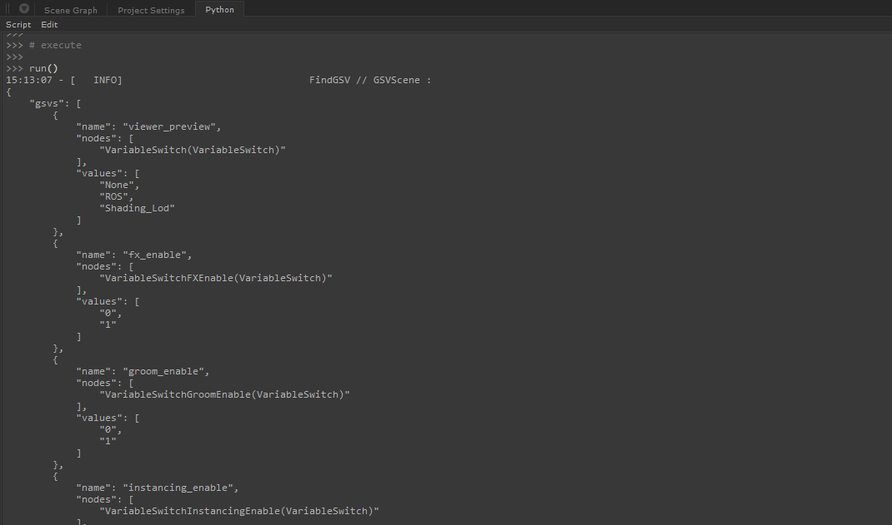

#  FindGSV


Easily find all local GSV in your Katana scene and their setup.




## Use

### Quick-see

Just run the [FindGSV.py](./FindGSV.py) script.
All the scene GSVs will be displayed in the console, formatted as a dictionnary with all the infos.

Demo on a personal lighting template :

```json
{
    "gsvs": [
        {
            "name": "viewer_preview", 
            "nodes": [
                "VariableSwitch(VariableSwitch)"
            ], 
            "values": [
                "None", 
                "ROS", 
                "Shading_Lod"
            ]
        }, 
        {
            "name": "groom_enable", 
            "nodes": [
                "VariableSwitchGroomEnable(VariableSwitch)"
            ], 
            "values": [
                "0", 
                "1"
            ]
        }, 
        {
            "name": "shot_lighting_setup", 
            "nodes": [
                "VariableSwitchLightingSetup_shot_001(VariableSwitch)"
            ], 
            "values": [
                "0", 
                "1", 
                "2"
            ]
        }, 
        {
            "name": "matte_mode", 
            "nodes": [
                "VariableSwitchMatteMode2(VariableSwitch)", 
                "VariableSwitchMatteMode3(VariableSwitch)", 
                "VariableSwitchMatteMode4(VariableSwitch)", 
                "VariableSwitchMatteMode5(VariableSwitch)", 
                "VariableSwitchMatteMode6(VariableSwitch)", 
                "VariableSwitchMatteMode7(VariableSwitch)", 
                "VariableSwitchMatteMode8(VariableSwitch)", 
                "VariableSwitchMatteMode9(VariableSwitch)"
            ], 
            "values": [
                "matte", 
                "invisible"
            ]
        }, 
        {
            "name": "shading", 
            "nodes": [
                "switch_shaders(VariableSwitch)"
            ], 
            "values": [
                "Final", 
                "Preview", 
                "Grey"
            ]
        }
    ]
}
```

### As a module

You can strip the `USECASE` section off and use it as a module like :

```python
from FindGSV import GSVScene

gsv_scene = GSVScene()
gsv_scene.build()
```

You might need to consider reimplementing the logging properly and
also implement a better way to set the `CONFIG` variable.

## Documentation

### Dependencies

- `json, collections, sys, logging` (Python 2)

- `typing` (Python 3)

- `NodegraphAPI` (Katana)

### Objects

#### `global` `(logging.logger)` logger 

logger from logging module.

#### `global` `(int)` TIME 

current katana scene time

#### `global` `(dict)` CONFIG 

Configure how the script behave. 

```markdown
[lvl 0]
[key=exclude:value](list):
    variable names that will be removed from result
[key=nodes:value](dict):
    List the node that make use of local GSVs.
```
```markdown
[lvl 1]
[key=nodes:value.key](str):  
    katana node type 
[key=nodes:value.key:value](dict):  
    parameters path on node that help build the GSV
```  
```markdown
[lvl 2]
[key=nodes:value.key:value.key=name:value](str):  
    parameters path on node to get the variable name
[key=nodes:value.key:value.key=values:value](str):  
    parameters path on node to get the values the variable can take
```

Default is :

```json
{
    "excluded": ["gafferState"],
    "nodes": {
        "VariableSwitch": {
            "name": "variableName",
            "values": "patterns"
        },
        "VariableEnabledGroup": {
            "name": "variableName",
            "values": "pattern"
        }

    }
}
```

#### `class` GSVNode

Low-level object.
A Katana node that use the GSV feature.


```
Args:
    node(NodegraphAPI.Node):
```

#### `class` GSVLocal

Low-level object.
Represent a GSV as a python object. Allow knowing which node is using this
gsv and what value it can take.

```
Args:
    name(str): gsv name used in the nodegraph
    scene(GSVScene): parent scene
```

#### `class` GSVScene

A group of node associated with an arbitrary number of gsvs.
This is the top level objet that should be used for manipulation.

##### `function` GSVScene.build()

Instance is empty on init. You need to call `build()` to populate its 
content. You can then use the 2 attributes `nodes` and `gsvs`.

##### `function` GSVScene.todict()

Return a dictionary representation of the class instance (example in
the above [Quick-see](###Quick-see) section).

##### `attribute` `(list of GSVNode)` GSVScene.nodes

List of nodes in the scene that make use of the local GSV feature.

##### `attribute` `(list of GSVLocal)` GSVScene.gsvs

List of local GSV in the scene as `GSVLocal` instances.

## Licensing

Apache License 2.0

See [LICENSE.md](./LICENSE.md) for full licence.

- ✅ The licensed material and derivatives may be used for commercial purposes.
- ✅ The licensed material may be distributed.
- ✅ The licensed material may be modified.
- ✅ The licensed material may be used and modified in private.
- ✅ This license provides an express grant of patent rights from contributors.
- 📏 A copy of the license and copyright notice must be included with the licensed material.
- 📏 Changes made to the licensed material must be documented