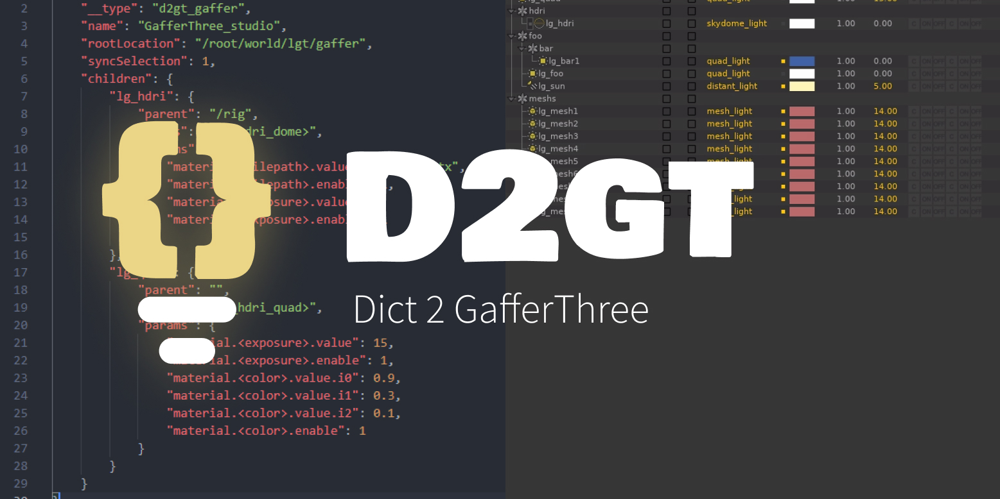

#  Dict 2 GafferThree


Create and build a GafferThree node from a python dictionary.



# Features

- Render Engine agnostic.
- Flexible thanks to a token system.
- Simple dictionary syntax.

Demo:

```python
token = {
    "__type": "d2gt_token",
    "lg_hdri_dome": "ArnoldHDRISkydomeLightPackage",
}
td = TokenDict(token)

scene = {
    "__type": "d2gt_gaffer",
    "name": "GafferThree_studio",
    "rootLocation": "/root/world/lgt/gaffer",
    "syncSelection": 1,
    "children": {
        "lg_hdri": {
            "parent": "/rig",
            "class": "<lg_hdri_dome>",
            "params": {}
        },

    }
}
gd = GafferDict(scene, tokendict=td)
gaffer = D2gtGaffer(gafferdict=gd)
gaffer_node = gaffer.build()
```


# Documentation

[](doc/INDEX.md)


> Or see the [./doc directory](doc).

# Licensing

Apache License 2.0

See [LICENSE.md](./LICENSE.md) for full licence.

- ✅ The licensed material and derivatives may be used for commercial purposes.
- ✅ The licensed material may be distributed.
- ✅ The licensed material may be modified.
- ✅ The licensed material may be used and modified in private.
- ✅ This license provides an express grant of patent rights from contributors.
- 📏 A copy of the license and copyright notice must be included with the licensed material.
- 📏 Changes made to the licensed material must be documented