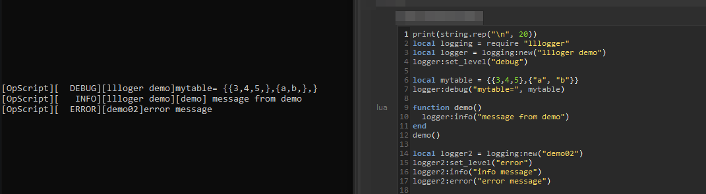
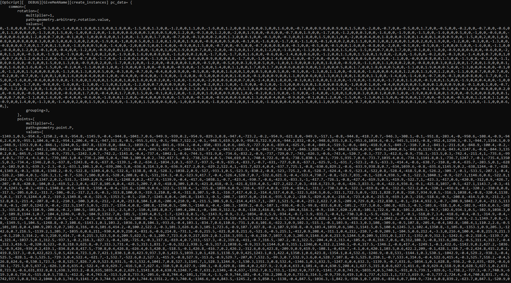

# llloger


A simple lua logging module based on Python one. 
Originaly made for use with Foundry's Katana software, OpScript feature.



## Features

- Log level system where you can define what level of message is allowed to be displayed.
- Multiples logger with different log level can be created in the same script.
- Convert tables and nested tables to a human-readable string (see settings).
- Multiples arguments can be passed : `logger:debug("text", 69, {"table"})`
- Prefix the message with the function's name the log is being called from.
- Should be loop safe (no string concatenation)
- String formatting settings class with options to format the displayed output:
  - number : round decimals
  - string : display literal quotes around strings
  - tables : display tables with line breaks or as one-line
  - tables : indent amount for multi-line tables
  - tables : toggle display of tables indexes
  - tables : maximum table length allowed before the table is forced to one-line

## Installation & Use

You have 2 options to install the script :

### Insert inline

Paste the code of the [./lllogger.lua](./lllogger.lua) at
the top of your OpScript code.

Rename the logger by changing the string passed to `new()` (last line).

You can then use the following functions :

```lua

logger:debug("any object")
logger:info("any object")
logger:warning("any object")
logger:error("any object")

```

The `LOG_LEVEL` variable can have the following values :
```lua

local LOG_LEVEL = "debug"
local LOG_LEVEL = "info" 
local LOG_LEVEL = "warning"
local LOG_LEVEL = "error"

```
but you can also override it by using : 
```lua
logger:set_level("warning")
```

### Module

Save the [./lllogger.lua](./lllogger.lua) file somewhere.

**Replace** the last line that declare the logger variable with :

```lua
return logging
```

Add the location of the `lllogger.lua` to the Katana `LUA_PATH` env variable.

Example for windows batch file :

```batch
set "LUA_PATH=%LUA_PATH%;Z:\somedir\katana\lllogger.lua"
```

In your OpScript you can then do :

```lua
local logging = require "lllogger"
local logger = logging:new("Test")

logger:debug("this is a debug message")

logger:set_level("error")

logger:info("this is an info message")
logger:error("this is an error message")
```

### Formatting

version 9+ include some formatting options to customize the displayed result.
These settings are stored on the logger in the `formatting` key. You can then 
use the functions or directly override the keys :

```lua
local logging = require "lllogger"
local logger = logging:new("TestFmt")

-- these 2 lines does the same thing
logger.formatting:set_tbl_linebreaks(true)
logger.formatting.tables.linebreaks = true

-- all function with default value
logger.formatting:set_num_round(3)
logger.formatting:set_str_display_quotes(false)
logger.formatting:set_tbl_display_indexes(false)
logger.formatting:set_tbl_linebreaks(true)
logger.formatting:set_tbl_length_max(50)
logger.formatting:set_tbl_indent(4)
logger.formatting:set_tbl_display_functions(true)

```

Example with a table containing lot of data, table is displayed as multiples
lines except for the tables with a lot of values.



## About

The message will be printed only if the `LOG_LEVEL` variable has a lower 'weight'
than the level used.

As at the end, `lllogger` use `print()` to display the content. 
You should remember that in Katana, printing in the console has a latency cost. 
So having just 3 message log times the number of location the script is excuted
to can lead to crappy pre-render performance.

To avoid this you can abuse of `logger:debug` during development and then switch
`LOG_LEVEL`  (or use `logger:set_level()`) to `info` at publish time and make
sure there is only a few `logger:info` calls.

## Licensing

Apache License 2.0

See [LICENSE.md](./LICENSE.md) for full licence.

- ✅ The licensed material and derivatives may be used for commercial purposes.
- ✅ The licensed material may be distributed.
- ✅ The licensed material may be modified.
- ✅ The licensed material may be used and modified in private.
- ✅ This license provides an express grant of patent rights from contributors.
- 📏 A copy of the license and copyright notice must be included with the licensed material.
- 📏 Changes made to the licensed material must be documented

## Development

### Using outside of Katana

You can remove the `"[OpScript]"` prefix by modifying the `_log` method of the
`logging` class.

Everything else should work outside of Katana.
