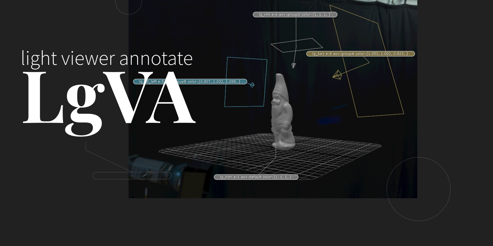

#  Light Viewer Annotate


Annotate (& color) lights in the viewer using their attributes.

The annotation is generated based on token that will query the corresponding attributes on the light location.

For example `<name> expo:<exposure> samples:<samples>` would give :
```
lg_test expo:15.5 samples:2
```




# Features

- Multiple render-engine support (expandable): `3delight`, `Arnold`, `RenderMan`
- Color annotations based on light's color.
- Color the light in the viewer based on its color.
- HSV control for the viewer color.
- Flexible token configuration.


# Documentation

[](doc/INDEX.md)

> Or see the [./doc directory](doc).

# Legal

Apache License 2.0

See [LICENSE.md](LICENSE.md) for full licence.

- ✅ The licensed material and derivatives may be used for commercial purposes.
- ✅ The licensed material may be distributed.
- ✅ The licensed material may be modified.
- ✅ The licensed material may be used and modified in private.
- ✅ This license provides an express grant of patent rights from contributors.
- 📏 A copy of the license and copyright notice must be included with the licensed material.
- 📏 Changes made to the licensed material must be documented

You can request a specific license by contacting me at [monsieurlixm@gmail.com](mailto:monsieurlixm@gmail.com) .

<a href='https://ko-fi.com/E1E3ALNSG' target='_blank'>

</a> 

