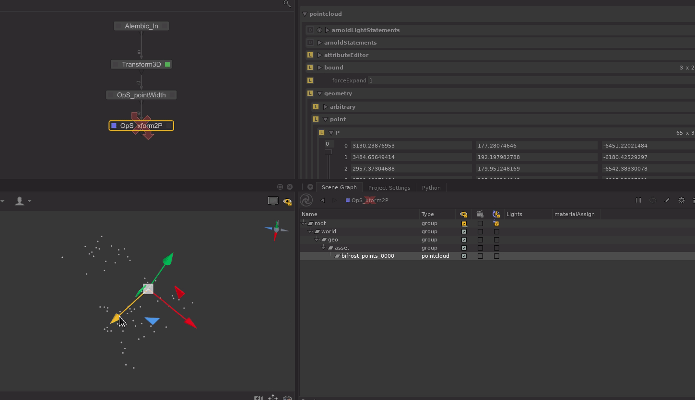

# Pointcloud Xform to P

Allow merging xform transformations on a pointcloud location to the `geometry.point.P` attribute. (so translate+rotate only).

## Installation

### .lua

Create a new OpScript node and copy/paste the content of the .lua script inside.
Follow the instructions on the top comment to setup the node.

## Guide

⚠ If your `xform` is interactive, you need to disable this Op before trying to move it in the viewer.

If the locations matched by CEL doesn't have a `geometry.point.P` it will yield an error so check your CEL.
